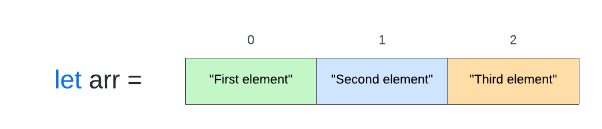

# What is an Array?
In computer science, an `array` is a data structure which stores a collection of elements in contiguous memory locations. `Contiguous memory` means that all data resides within consecutive blocks of memory.

The `array` data structure is utilize in many different programming langues. In this lecture we will be discussing `arrays` within the context of JavaScript.

## Table of Content
- [What is an Array?](#what-is-an-array)
  - [Table of Content](#table-of-content)
  - [Learning Objectives](#learning-objectives)
  - [Creating an Array](#creating-an-array)
  - [Storing Data](#storing-data)
  - [Accessing an Array](#accessing-an-array)
  - [Closing](#closing)
  - [Glossary](#glossary)
  - [Resources](#resources)

## Learning Objectives
By the end of this lecture students:
* Should be able to define and explain what an array is within the context of JavaScript
* Declare a JavaScript array

## Creating an Array
An `array` is always stored within a referenceable container called a `variable`. By storign an `array` within a `variable` you are able to call upon it whenever you would like. In JavaScript `arrays` are denoted by the *[]* syntax. Let's take a look at how you would delcare an empty `array` called *arr*: 

```js
let arr = []
```

## Storing Data
Each piece of data that is stored within an `array` is called an `element`. Traditionally `arrays` only store `elements` of the same data type, but JavaScript is a bit different in this regard. With JavaScript you are able to store elements of different data types within an `array`. 

`Arrays` store elements within boxes that are identified as an `index`. A great way to visualize this is to think about a excel table:



If you notice the first element is located within position *0* this is because arrays utilize `zero-based numbering`. `Zero-based numbering` is a way of counting where the first number within an sequence will always be 0.

Let's see how this array would actually look in our code:

```js
let arr = ["First element", "Second element", "Third element"]
```

## Accessing an Array
In order to access data within an `array` you must refer to the `element` by the `index` it is located in. Let's take a look at our `array` from before and access the first element:

```js
let arr = ["First element", "Second element", "Third element"]

console.log(arr[0])

// Outputs: "First element"
```

## Closing
As stated, `array` are a data sturcute which store a collection of data. They are a very powerful data type that can be utilize within many different programming languages.

## Glossary
Important terms utilize throughout the lesson:

* `Array`: data structure which stores a collection of element in contiguous memory location
* `Contiguous memory`: data that resides within consecutive blocks of memory
* `Element`: piece of data that is stored within an array
* `Index`: location of elements store within an array 
* `Variable`: a referenceable container which stores data
* `Zero-based Numbering`: the first number within an sequence will always be 0

## Resources
Want to continue learning more about arrays? Check out some of these resources:
* [BiteSize: Array and List](https://www.bbc.co.uk/bitesize/guides/zy9thyc/revision/1#:~:text=An%20array%20is%20a%20series,of%20the%20same%20data%20type%20)
* [Wikipedia: Zero-based Numbering](https://en.wikipedia.org/wiki/Zero-based_numbering)
* [MDN: JavaScript Array](https://developer.mozilla.org/en-US/docs/Web/JavaScript/Reference/Global_Objects/Array)
* [C++ For Engineers](https://www.cpp.edu/~elab/ECE114/Array.html)
* [JavaScript Tutorial: JS Arrays](https://www.javascripttutorial.net/javascript-array/)
* [Educative: Contiguous Memory](https://www.educative.io/edpresso/contiguous-memory)

